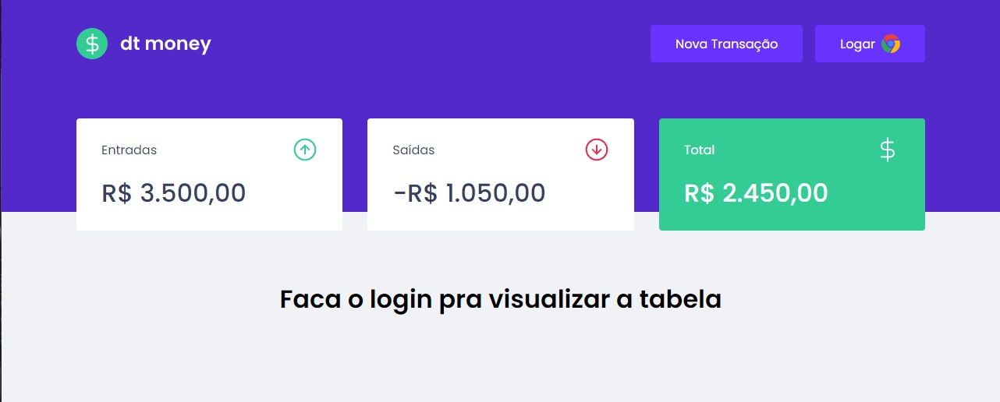

 
#dt money

<h2>Acesse para testar no <a href="https://dtmoney-blush.vercel.app/">Link</a> </h2>
## Tópicos 

[Sobre o dt money](#sobre-o-dt-money)

[Alterações Pessoais](#alterações-pessoais)

[Tecnologias](#tecnologias)

[Instalação e uso](#instalação-e-uso)

<br>

## Sobre o dt money
O dt money é uma alternativa simples e eficaz para gerenciar suas finanças, permitindo o cadastro de entradas, saídas e a organização das mesmas em categorias.
<br>

## Alterações pessoais
=>Incrementei junto ao projeto um DB real com o Firebase e o login social do Google usando a ferramenta de autenticação do próprio.
=>Bloqueei o acesso as informações e a permissão de cadastrar apenas para pessoas logadas, fazendo uma basica interação com o Local-Storage pegando o Token de acesso depois do usuario logado.
<br>

<p align="center">
  
</p>

<p align="center">
  
</p>

<p align="center">
  
</p>


## Tecnologias

Tecnologias e ferramentas utilizadas no desenvolvimento do projeto:

- [React](https://reactjs.org/)
- [TypeScript](https://www.typescriptlang.org/)
- [Styled Components](https://styled-components.com/)
- [MirageJS](https://miragejs.com/)
- [Axios](https://github.com/axios/axios)
- [Polished](https://polished.js.org/)
- [Firebase DB -- Incrementação Pessoal](https://firebase.google.com//)

<br>

## Instalação e uso

```bash
# Abra um terminal e copie este repositório com o comando
git clone https://github.com/3ddybr/dtmoney.git
# ou use a opção de download.

# Entre na pasta web com 
cd dtmoney

# Instale as dependências
yarn install

# Rode a aplicação
yarn start
```
<br>
